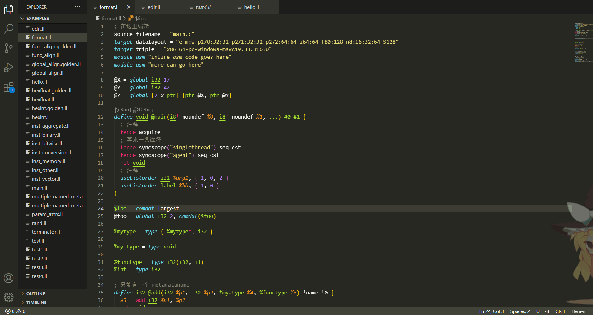

# llvm-ir-language-support
This plugin provides functions such as syntax highlighting, code formatting, and hover prompts for the `llvm ir` language.

## features
  - [x] syntax highlighting
  - [x] Code formatting
  - [x] Hover tooltip
  - [x] Error diagnosis
  - [x] jump definition
  - [x] View references
  - [ ] Autocompletion

## Code formatting

## Hover prompt
When the mouse rolls over an `instruction`, its documentation will be displayed.

When the mouse hovers over the variable, the type will be prompted, and when the mouse hovers over `comdat`, `attrgroup` and `type`, their definitions will be displayed.

## Error Diagnosis

## Go to Definition

## View References

