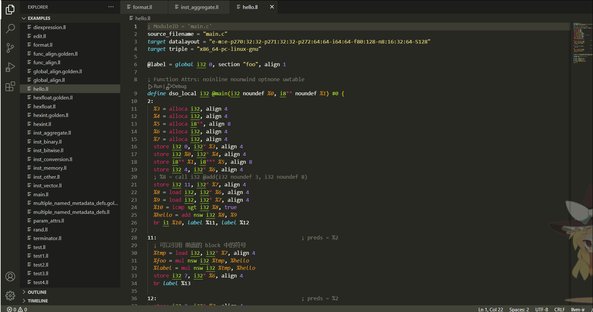

# llvm-ir-language-support
本插件为  `llvm ir` 语言提供语法高亮、代码格式化、悬浮提示等功能。

## features
 - [x] 语法高亮
 - [x] 代码格式化
 - [x] 悬浮提示
 - [x] 错误诊断
 - [ ] 跳转定义
 - [ ] 查看引用

## 代码格式化

## 悬浮提示

当鼠标滑过变量时候，会提示类型，滑过 `comdat`、`attrgroup` 和 `type` 的时候，会显示他们的定义。
## 错误诊断

